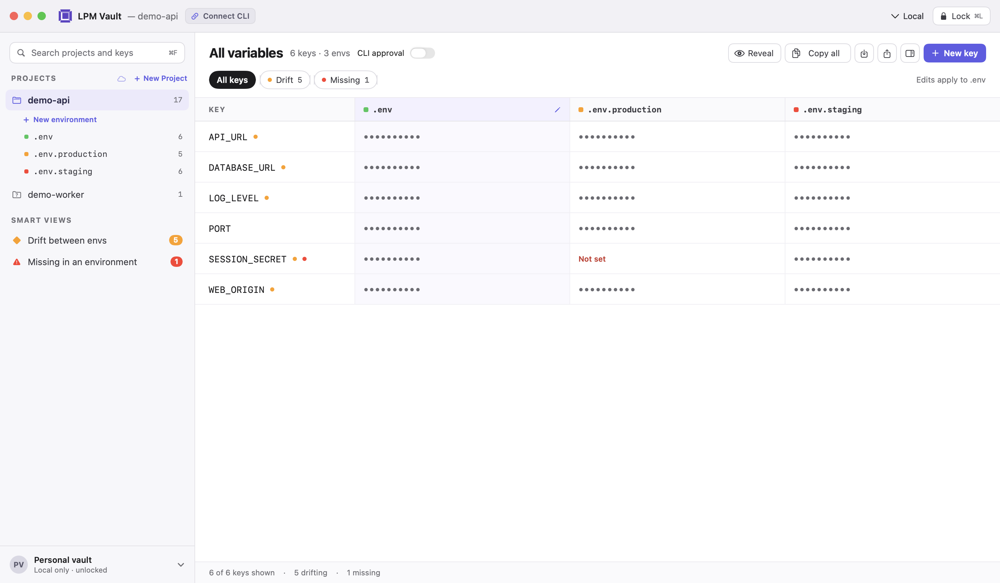

<p align="center">
  <a href="https://vault.lpm.dev"></a>
</p>

<h1 align="center">LPM Vault</h1>

<p align="center">Project environment variables and secrets for your Mac.</p>

<p align="center">
  <a href="https://vault.lpm.dev/download">Download for Mac</a> ·
  <a href="https://cli.lpm.dev/docs/dev/lpm-vault">Documentation</a> ·
  <a href="https://github.com/lpm-dev/lpm-vault/releases">Releases</a> ·
  <a href="SECURITY.md">Security</a>
</p>

LPM Vault is a native macOS app for project environment variables and secrets.
It stores local values in the macOS Keychain and shares them with the signed LPM CLI.
Optional encrypted sync connects personal and organization env projects through [LPM.dev](https://lpm.dev).



The screenshot uses dummy project data. It contains no real credentials.

## Install

LPM Vault supports **macOS 14 or later**, on **Apple silicon and Intel**.
Touch ID is optional. You can unlock the app with your Mac login password.

1. [Download the current installer](https://vault.lpm.dev/download).
2. Open the DMG.
3. Drag **LPM Vault** into **Applications**.
4. Open **LPM Vault**.

Official releases include Developer ID signatures and Apple notarization.
The application menu provides **Check for Updates…**.
Sparkle asks before it enables background update checks.

## What you can do

- Manage project variables across multiple environments.
- Compare values and find missing keys in the environment matrix.
- Import and export `.env` files.
- Unlock with Touch ID or your Mac login password.
- Use local values from `lpm env`, `lpm dev`, and `lpm run`.
- Sync encrypted data to personal or organization env projects.
- Choose System, Light, or Dark appearance.

Local project storage does not require an LPM.dev account.
Cloud sync requires an account and the permissions for the selected project.

## Start with a project

1. Unlock the app.
2. Create an env project.
3. Add environments, then add variables or import an `.env` file into each environment.
4. Use **All variables** to compare environments.
5. To connect the CLI, use **Connect CLI** for the selected project.

The connection sheet links a project directory through `lpm.json`.
Install the [official LPM CLI](https://cli.lpm.dev/docs/installation) for shared Keychain access.
Then run a project script:

```sh
lpm run dev
```

See the [app guide](https://cli.lpm.dev/docs/dev/lpm-vault) and [env guide](https://cli.lpm.dev/docs/dev/env) for environment selection.

## CLI approval

Select a project. Use **CLI approval** beside **All variables** to control CLI access for that project.

- **Off:** `lpm run` injects env values automatically.
- **On:** macOS requires Touch ID or your Mac login password before Keychain releases env values.

If authentication fails or you cancel it, LPM stops before it runs lifecycle hooks or the main script.

The sidebar shows a folder for automatic CLI access and a lock for required CLI approval.
Change the setting while the app is unlocked. This change requires no extra authentication prompt.
The setting applies to every environment in the selected project on this Mac.

The app's **Lock** button hides secrets and clears the app's authentication context.
It does not change CLI approval.

CLI approval protects secret reads and temporary records used during updates.
It does not revoke values that a process already received.

## Changes from the CLI

When you return to the unlocked app, it reloads local changes from the LPM CLI.
Use **Refresh** to reload changes while the app stays active.
This reads project metadata, CLI approval, and secrets for the selected project. It does not contact the cloud.

Unsaved editor values remain in the editor. A changed or deleted secret shows a conflict and blocks Save.
Copying and exporting wait for a refresh in progress, so they use the reloaded values.
If a refresh fails, copying, revealing, and exporting pause until **Retry** succeeds.
Automatic refresh does not extend the idle-lock timer. The locked app does not read secret values.

## Security and privacy

Local secrets use the Data Protection Keychain on this Mac. They do not sync through iCloud Keychain.
Cloud sync encrypts values on your Mac before upload.
Exported `.env` files and copied values require separate protection.

The Mac app sends no analytics.
The website uses limited analytics and provides an opt-out control.
Read [PRIVACY.md](PRIVACY.md) for network activity and website privacy.

Read the [security model](https://cli.lpm.dev/docs/infra/secrets-vault) for storage and sync details.
Report suspected vulnerabilities privately through [SECURITY.md](SECURITY.md).

## Support and contributions

Read [SUPPORT.md](SUPPORT.md) for troubleshooting and issue reporting.
Read [CONTRIBUTING.md](CONTRIBUTING.md) for development setup and CI checks.
Signed builds and release procedures are in [RELEASING.md](LPMVault/RELEASING.md).

Source builds need their own signing identity and storage contract for Keychain access.
Use the official installer for production secrets and CLI integration.

LPM Vault is part of [LPM CLI](https://cli.lpm.dev), [LPM.dev Registry](https://lpm.dev), and [LPM Firewall](https://firewall.lpm.dev).

## License

Dual-licensed under **MIT OR Apache-2.0**, at your option.
See [LICENSE-MIT](LICENSE-MIT) and [LICENSE-APACHE](LICENSE-APACHE).
Third-party components retain their own licenses.
